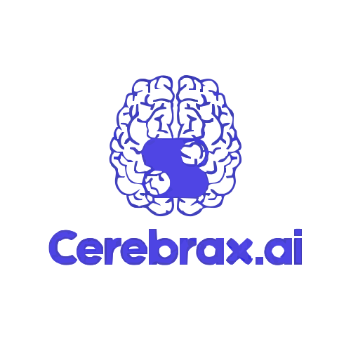

<p align="center">
  
</p>

# Cerebrax.ai – Your AI Content & Image Hub  

[](https://github.com/nishantgawderya1/Cerebrax.ai) [](https://github.com/nishantgawderya1/Cerebrax.ai/issues) []() []() []()


**Cerebrax.ai** is an AI-powered platform designed to **supercharge content creation and image editing**. It bundles tools for writing blog articles, generating catchy titles, removing backgrounds or unwanted objects from photos, and even reviewing resumes – all accessible through a clean, developer-friendly interface. Built on a modern stack, Cerebrax.ai makes complex AI tasks simple.  

## ✨ Highlights  
- **Fast Content Generation:** Create articles and titles in seconds using AI.
- **All-in-One Toolkit:** Multiple AI features (writing, image editing, resume analysis) in one place — no need to switch apps.  

## 📸 Quick Preview  

[AI-Tools](client/src/assets/Screenshot 2025-08-09 230949.png)
[Sign Up Page](client/src/assets/Screenshot 2025-08-09 230931.png)
[Dash-Board](client/src/assets/Screenshot 2025-08-09 231037.png)
[Image Generation Using AI](client/src/assets/Screenshot 2025-08-09 231051.png)


## 🚀 Why This Project Matters  
- **Effortless Content Creation:** Generating blog posts and social media copy is labor-intensive. Cerebrax.ai automates first drafts and title ideas, massively speeding up content workflows.
- **Smart Image Editing:** Manually editing images (e.g., removing backgrounds) is time-consuming. Our AI background and object removal tools handle this in one click.
- **AI Resume Feedback:** Job seekers get instant, recruiter-informed feedback on their resumes.
- **Unified Workflow:** By combining all these AI capabilities in one platform, Cerebrax.ai eliminates juggling multiple tools and streamlines creative workflows.

## 🔧 Tech Stack & Architecture  
- **Frontend:** React & Vite 
- **Backend:** Express , Node.js 
- **API's** OpenAI (openai 5.12.0), Cloudinary (cloudinary 2.7.0), Clerk (clerkexpress, clerkbackend, clerkshared) 
- **Database:** PostgreSQL  
- **Infrastructure:** Vercel  
- **API Testing** Postman

## ⚙️ Installation & Usage  

1. **Clone the repo:**  
   ```bash
   git clone https://github.com/nishantgawderya1/Cerebrax.ai.git
   cd Cerebrax.ai
   ```  
2. **Install dependencies:**  
   ```bash
    node -v      # install node
    
    npm -v

    npm init -y  #initialize node 

    npm install express 
        

    npm create vite@latest
   ```  
3. **Run the application:**  
   ```bash
   npm run dev           # starts the Next.js dev server
   npm run server        # starts the Express
   ```  
4. **Open in browser:** Visit `http://localhost:3000`

## 📈 Project Status & Roadmap  

- **Next Milestones:** Performance improvements, mobile UI, new AI models.  
- **Coming Soon:** All premium features will be free once server optimizations are complete 🎉  

## 🤝 Contributing  
1. Fork the repository  
2. Create a new branch (`feature/my-feature`)  
3. Commit changes  
4. Open a Pull Request  

## 👤 About the Author  
**Built with ❤️ by Nishant Gawderya**  
- ✉️ Email: nishantgawdiya@gmail.com  
- 🔗 LinkedIn: [Nishant Gawderya](https://www.linkedin.com/in/nishant-gawderya/)  
